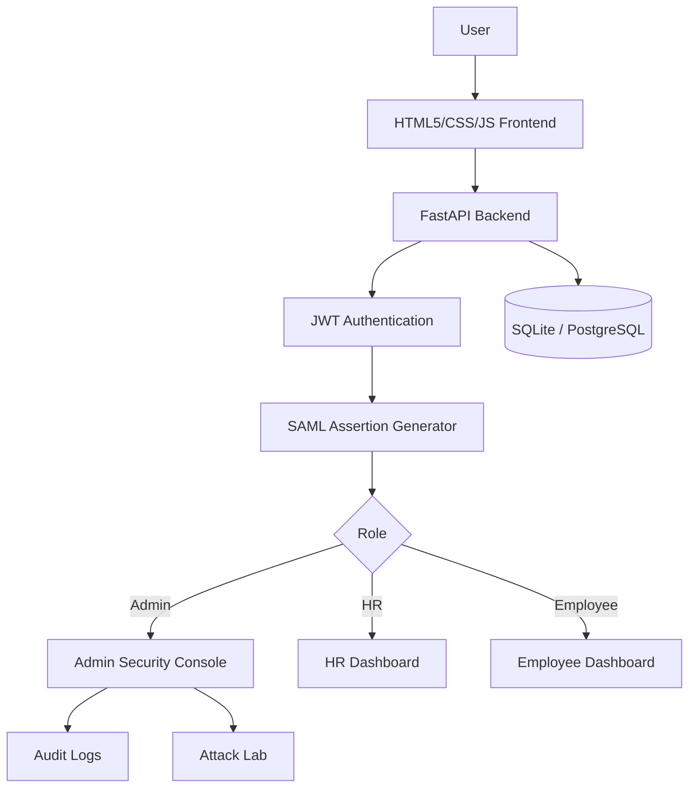

# 🛡️ SAMLGuard

> **Enterprise SAML 2.0 Identity Provider with Single Sign-On (SSO), JWT Authentication, Role-Based Access Control (RBAC), Security Attack Detection, and Audit Logging**


------------------------------------------------------------------------

## 📖 Overview

SAMLGuard is a full-stack identity provider inspired by enterprise SSO platforms. It authenticates users, generates SAML assertions, enforces RBAC, detects common SAML attacks, and records security events.

## ✨ Features

- JWT Authentication
- Role-Based Access Control (Admin / HR / Employee)
- SAML Assertion Generation
- Single Sign-On workflow
- Replay Attack Detection
- XML Signature Wrapping (XSW) Detection
- Attribute Injection Detection
- Security Audit Logs
- Pure HTML, CSS, JavaScript Frontend
- FastAPI Backend with SQLite / PostgreSQL

## 🏗️ Architecture



## 🔑 Default Test Credentials

| Role | Email | Password | Department | Access Level |
| :--- | :--- | :--- | :--- | :--- |
| **Admin** | `admin@company.com` | `admin123` | IT | Admin Console, Attack Lab, Audit Logs |
| **Admin** | `admin@samlguard.com` | `admin123` | Security | Admin Console, Attack Lab, Audit Logs |
| **HR** | `hr@company.com` | `hr123` | Human Resources | HR Dashboard, Wiki, Directory |
| **HR** | `hr@samlguard.com` | `hr123` | Human Resources | HR Dashboard, Wiki, Directory |
| **Employee** | `employee@company.com` | `emp123` | Cyber Security | Employee Dashboard, Wiki, Directory |
| **Employee** | `employee@samlguard.com` | `emp123` | Engineering | Employee Dashboard, Wiki, Directory |

## 🔐 RBAC Matrix

| Role | HR Portal | Employee Portal | Admin Console | Audit Logs | Attack Lab |
| :--- | :---: | :---: | :---: | :---: | :---: |
| **Admin** | ❌ | ❌ | ✅ | ✅ | ✅ |
| **HR** | ✅ | ❌ | ❌ | ❌ | ❌ |
| **Employee** | ❌ | ✅ | ❌ | ❌ | ❌ |

## 🚀 How to Run

### 1. Backend (FastAPI)

```bash
cd backend
python -m venv .venv
..\.venv\Scripts\activate
pip install -r requirements.txt
python -m uvicorn app.main:app --reload
```

### 2. Frontend (Pure HTML / CSS / JS)

Simply open `frontend-react/index.html` directly in your browser, or serve it using Python:

```bash
cd frontend-react
python -m http.server 5173
```
Then open `http://127.0.0.1:5173` in your browser.

### 3. Re-seed / Reset Database

```bash
cd backend
python seed.py
```

## 📡 API Endpoints

- `POST /auth/register` - Register a new employee user
- `POST /auth/login` - User authentication & JWT token generation
- `GET /users/me` - Fetch authenticated user profile
- `GET /saml/login` - Issue signed SAML 2.0 assertion
- `POST /saml/replay` - SAML Replay attack detection test
- `POST /saml/xsw` - XML Signature Wrapping attack test
- `POST /saml/attribute-injection` - Attribute injection attack test
- `GET /audit/logs` - Fetch security audit logs

## 📂 Project Structure

```text
SAMLGuard/
├── backend/
│   ├── app/
│   │   ├── api/          # FastAPI routers (auth, saml, audit, attacks)
│   │   ├── core/         # Config & JWT security settings
│   │   ├── database/     # SQLAlchemy database connection
│   │   ├── models/       # DB Models (User, Role, ServiceProvider)
│   │   └── security/     # Passlib password hashing & JWT logic
│   ├── alembic/          # DB migration scripts
│   ├── samlguard.db      # SQLite database file
│   └── seed.py           # Database seeder script
├── frontend-react/
│   ├── assets/
│   │   ├── css/          # Global styles & dark mode theme
│   │   └── js/           # API wrapper, navbar loader & page logic
│   ├── index.html        # Landing page
│   ├── login.html        # Login page
│   ├── admin-dashboard.html
│   ├── hr-dashboard.html
│   ├── employee-dashboard.html
│   ├── attack-lab.html
│   ├── assertion-viewer.html
│   ├── audit-logs.html
│   ├── company-wiki.html
│   └── employee-directory.html
└── README.md
```

## 👨‍💻 Author

**Manan Pathak**
